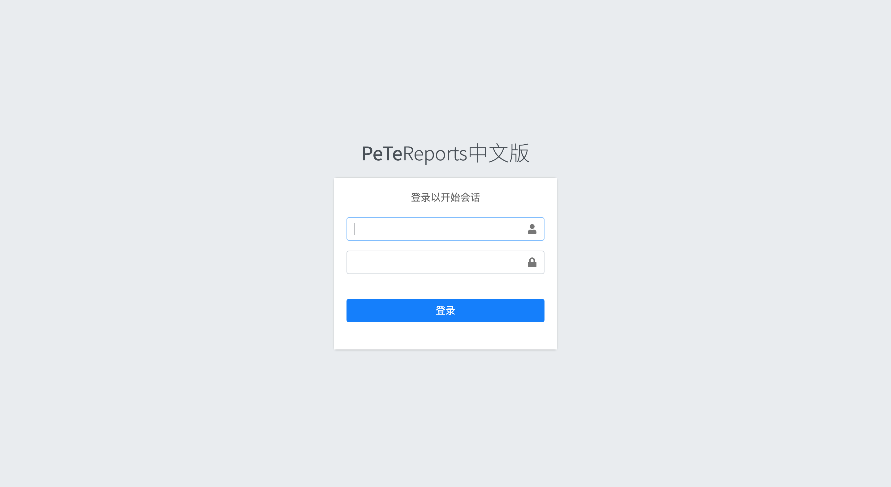
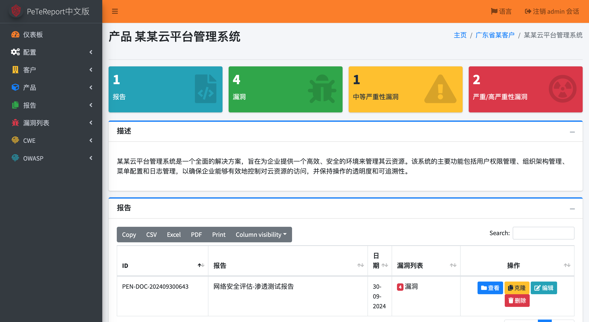
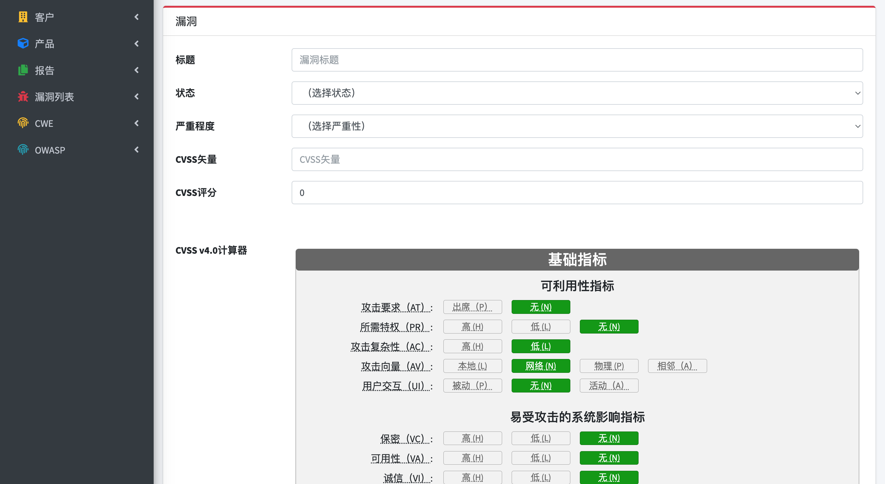
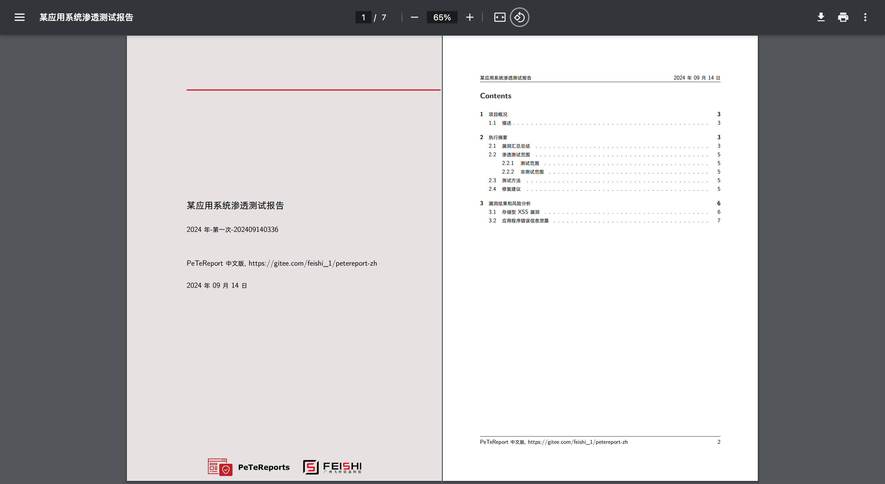
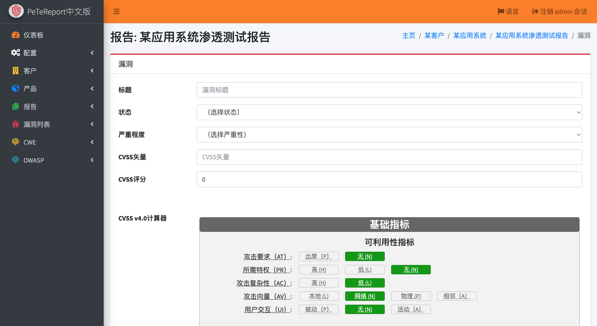
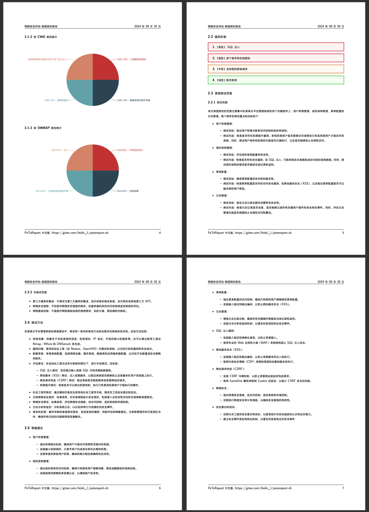
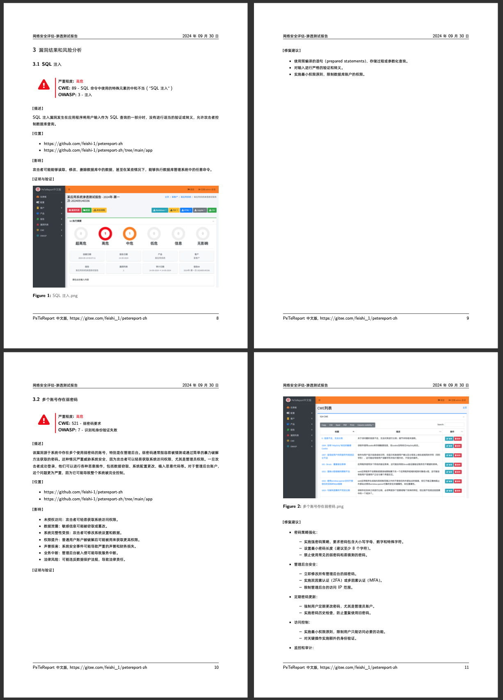

<p align="center">
  <a href="https://gitee.com/feishi_1/petereport-zh" target="_blank">
   
  </a>
</p>

<p align="center">
  PeTeReport中文版，辅助渗透测试过程，让渗透测试报告一键生成，守护网络安全！
</p>
<p align="center">
  <a href="https://hub.docker.com/r/feishi1/petereport-zh">
    
  </a>

  <a href="./LICENSE">
    
  </a>
</p>

# 简介 | Intro
`PeteReport-Zh`是经由`广州飞时-小虎队`渗透小组严选锤炼，基于英文版[PeteReport](https://github.com/1modm/petereport)进行中文改造的一个开源的渗透测试过程管理工具｜渗透测试协作工具｜渗透测试报告生成工具。
帮助渗透测试团队更高效地管理渗透测试过程，生成高质量的渗透测试报告。

# 优点 | Advantages

- **本地化定制**：基于英文版深度汉化，更适合国人用户的使用习惯，操作界面亲切友好。
- **一键式启动**：Docker安装过程简单快捷，一句命令即可启动，立即投入渗透测试工作。
- **团队协作高效**：优化团队协作流程，信息共享及时，任务分配明确，提升团队协作效率。
- **专业漏洞库**：集成CVSS计算器，搭载CWE专业化漏洞库及OWASP TOP 10，遵循国际安全标准。
- **报告生成快速**：自动生成高质量渗透测试报告，节省时间和人力资源。
- **定制化报告**：报告模板丰富，可后台配置和二次开发，提升渗透交付报告的专业度。
- **字体合法**：使用开源、可商用的阿里巴巴普惠字体，规避商业报告字体版权问题。
- **开源优势**：开源性质，便于社区支持和技术交流，持续优化和更新。
- **兼容性强**：支持多种操作系统和环境，兼容性强，适应不同用户需求。

# 一句话启动 | Start
电脑先安装[docker](https://docs.docker.com/engine/install/)，安装完成后执行以下其中一条命令即可启动：
## 国内用户可执行
感谢[腾讯云](https://console.cloud.tencent.com/tcr/repository)为本项目提供镜像加速服务
```
docker run -d --name petereport-zh -p 8000:8000 ccr.ccs.tencentyun.com/feishi1/petereport-zh:latest
```
## 海外用户可执行
```
docker run -d --name petereport-zh -p 8000:8000 feishi1/petereport-zh:latest
```

# 使用方法 | Usage
以上命令执行后，打开浏览器。
- 地址：`http://127.0.0.1:8000`
- 用户名：`admin`
- 密码：`P3t3r3p0rt`

这里有一个简单的视频介绍，可以帮助你快速上手：
> 视频地址：[https://www.bilibili.com/video/BV19S1iY5E4R](https://www.bilibili.com/video/BV19S1iY5E4R)

<p align="center">
   
   
</p>
<p align="center">
   
   
</p>
<p align="center">
   
   
</p>
<p align="center">
   
   
</p>

# 期望 | Futures
> 欢迎提出更好的意见，帮助完善 PeTeReport-Zh

# 版权 | License
[BSD 3-Clause License](./LICENSE)


